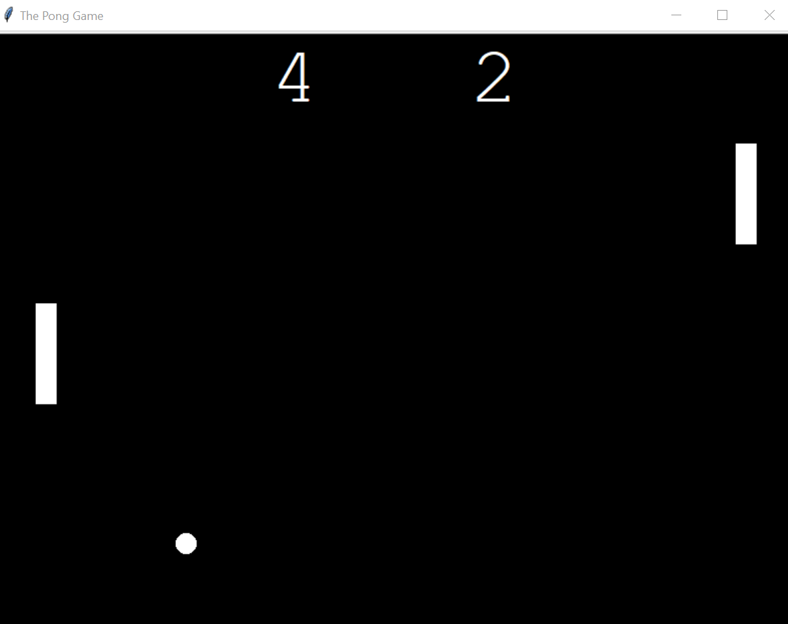

_This README.md file is in English and Portuguese. // Esse arquivo README.md está em Inglês e Português._

# The Pong Game, classic Atari, from old Video Games | Python

⚠️ _This was done as I followed up Angela Yu's Python Bootcamp tutorial on the Pong Game. You can find the course [on Udemy here](https://www.udemy.com/course/100-days-of-code/)._ ⚠️

The Turtle module was used to make this game. Three classes plus the main file were created: Paddle class, Ball class and Scoreboard class. This was done using the Object-Oriented-Programming paradigm.

KEYS TO RIGHT PADDLE:

- UP: Arrow "Up"
- DOWN: Arrow "Down"

KEYS TO LEFT PADDLE:

- UP: "w"
- DOWN: "S"

The Turtle Module was used for this game. Concepts of Object Oriented Programming (OOP) were also used.

# Jogo da Cobrinha dos Celulares Antigos | Python

 ⚠️ _Isso foi criado enquanto eu seguia o tutorial do Jogo da Cobrinha do Bootcamp de Python da Angela Yu. O curso está [disponível na Udemy aqui](https://www.udemy.com/course/100-days-of-code/)_. ⚠️

O jogo clássico do Atari recriado em Python.

O módulo Turtle foi usado para fazer esse jogo. Três classes mais o arquivo main foram criados: classe Paddle (Pá), classe Ball (Bola) e classe Scoreboard (Placar). Tudo feito sob o paradigma da Programação-Orientada-a-Objetos.

TECLAS PARA A RAQUETE DIREITA:

- SOBE: Tecla seta "cima"
- DESCE: Tecla seta "baixo"

TECLAS PARA A RAQUETE ESQUERDA:

- SOBE: "w"
- DESCE: "s"

O módulo da tartaruga (Turtle Module) foi usado para esse jogo, bem como conceitos da Programação Orientada a Objetos (POO).
